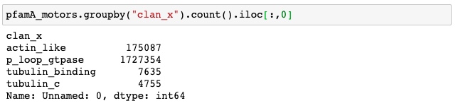
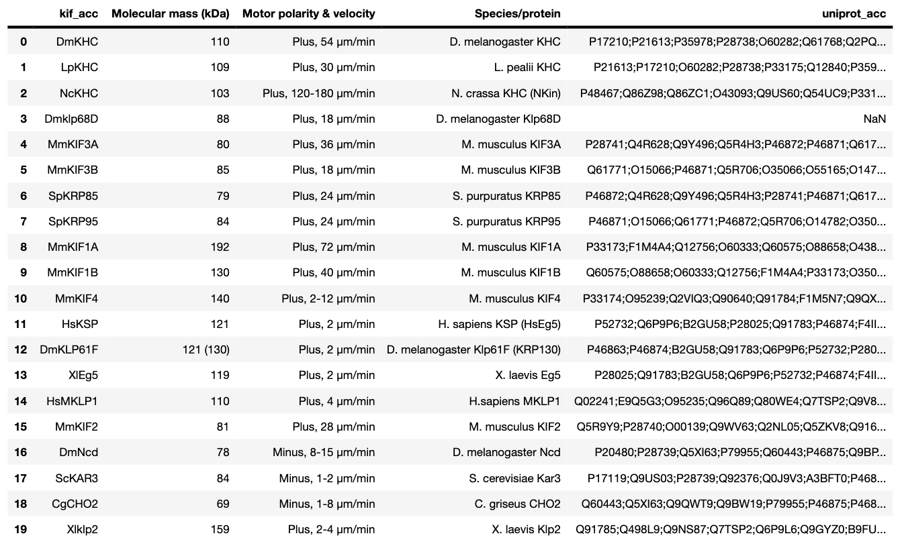

# Motor Protein embedding by NLP Transformer-based model

Rotation Term Report      Changhua Yu       Thomson lab      Winter 2020

## Introduction & Project Aim 

​	  With the ground-breaking paper **Attention Is All You Need** [1] published in 2017 and the pre-train language embedding model **BERT** being introduced to academia, multi-head attention models are bringing unprecedented changes in the natural language processing field, and are quickly becoming the new state-of-art models. [2] The purely attention-based model outperforms previous sequentional RNN models (LSTM and GRU, for instances) on multiple tasks, with the rationale being that transformer performs autoregressive process to access any part of the previously generated output at every step of generation, whereas recurrent network structures learn to proactively store elements to be referenced in a fixed size state or memory. The success of self-attention model in learning natural language representation suggests that it is a suitable architecture to learn sequential data governed by an underlying grammatical structure and it is capable of capturing the connection between two far-apart time steps in a sequence. (For example, "Helen" and "she" may refer to the same person in a long sentence)

​	  Protein amino acid sequences are sequential information, and they are also governed by the "grammatical rule" of physical folding, the evolutionarily directed changes, and stability/functionality drive to fit certain living condition. Moreover, two distant amino acid on 1D sequence may be strongly connected in protein folded tertiary structures. Thus, applying NLP models for language modelling and representation seems promising for representing the underlying rules of protein latent space. Protein latent space representation may yield potential insights on controllable and predictable protein engineering and optimization. Some of the pioneering work of the field includes **Unirep** from Church's lab [3], a unidirectional mLSTM with 1900 units, and **SeqVec ** from Burkhard Rost lab, a bi-directional EMLo on UniRef50. [4] In a benchmarking paper from Song's lab, the **Tasks Assessing Protein Embeddings (TAPE)** constructed a set of five biologically relevant supervised tasks that evaluate the performance of learned protein embeddings across diverse aspects of protein understanding. [5] Transformer models outcompetes Unirep and ResNet model on language model metrics as well as fluorescence protein engineering and protein stability prediction, indicating its outstanding capacity of learning meaningful features for downstream tasks in an unsupervised manner.

​	  Although exploratory work and benchmark experiments were conducted and assured a great prospect of the field, the past work focused mostly on model development and the general protein engineering context, in that only "canonical" tasks such as GFP engineering and distant homology relationship detection were evaluated. Thomson lab's interests in studying active matter proteins thus propose a suitable biological context not yet well-studied. Moreover, motor proteins are universally present in Eukaryotes and also have distant homologues in some Prokaryotes; however, the properties of these proteins evolve through time to accomodate the diverse living form of organisms. It is thus worthwhile to inspect **to what extent transformer model captures evolutionary and function-related features of the motor proteins, and how well could the model aid specific downstream task to study and engineer the thermostability and the motility of active matter solely based on amino acid sequence in a semi-supervised manner. **

## Datasets Descriptions

#### 1. PfamA

> - Motor-related proteins belong to 4 superfamilies (Pfam Clans): actin-like, p loop gtpase, tubulin_c, tubulin binding
>
> - **PfamA_motors:** The dataset is the compilation of families from the above 4 clans from entire pfamA.fasta
>
>   - 
>
> - **PfamA_target:** A subset of PfamA_motors of Pfam families of detail inspection interests
>
>   
>
>   ​                                                          $\textrm{Pfam familes included in PfamA_target dataset}$
>
>   
>
>   
>
>   ​                                                           $\textrm{Number of entries in each Pfam families in PfamA_target}$
>
> - **PfamA_balanced:** 4500 entries from each clan, but family-wise may not be balanced, use to inspect both how 4 clans mapped on to a general background and could serve as a background when inspecting embedding of each pfam family within the clan.

#### 2. **UniRef50**

> - UniRef100 contains all UniProt Knowledgebase records plus selected UniParc records (see below). It is generated by clustering identical sequences and subfragments.UniRef50 is built by clustering UniRef90 seed sequences that have at least 50% sequence identity to and 80% overlap with the longest sequence in the cluster.
> - **UniRef50_01:** 1/10 of UniRef50 data for faster training/developing, 846396 rows
> - It turned out that UniRef50 data contains the full amino acid sequences of protein records, and training on protein sequences longer than 1000 amino acid may lead of CUDA GPU memory shortage on Caltech HPC cluster. Thus UniRef50 is not directly applied in any local model training
> - However, both ESM and UniRep model provide pre-trained weights on UniRef50 and transfer learning based on pre-trained protein language models are applied to embed motor-related proteins

​                                                                 $\textrm{UniRef50 provides sequence id and full amino acid sequence} $

​                                                                          $\textrm{Length Distribution of UniRef50 sequences} $

#### 3. Cymobase

> - **Cymobase** https://www.cymobase.org/cymobase  [6]
> - Includes Human curation and some level of annotations on the organism and protein classification, but does not include kinesin family classification and mobility information. I downloaded all the fasta files for each protein class (very tedious). In the end the database was not used for any training, but could be a searchable inventory for related publication

​                                                                            $\textrm{Cymobase is only available as a server query inferface} $

​                                                     $ \textrm{Cymobase: A database for cytoskeletal and motor protein sequence information}$

​                                                                          $\textrm{ statistics on Cymobase proteins from its website} $

#### 4. **ProtDataTherm:** 

- A database for thermostability analysis and engineering of proteins
- Paper: https://www.ncbi.nlm.nih.gov/pmc/articles/PMC5788348/#!po=50.0000
- DBSource: https://drive.google.com/drive/folders/1oOkUYSJXy8NUP1sQ5U0GQFNvSuwdjU67
- Claims to offer ~600k thermostable (Tm >40°C) proteins categorized by domain families (Pfams). 
- **pdt_motor.csv:** The overlap entries between ProtDataTherm and the four pfam superfamilies relating to motor proteins (p loop gtpase, actin like, tubulin c, tubulin binding)

#### 5. KIF (Kinesin Superfamily) Dataset

- **KIF Home Page from Duke** https://sites.duke.edu/kinesin/ 

  - Duke dataset does not contain any accession information, but contains amino acid sequences for kinesin domains. BLASTp against all the sequences is very time-ineffective. Instead, the unique information in this dataset is the kinesin direction and speed info of 20 kinesin proteins. For the 20 entries that have documented mobility information, use BLASTp then uniprot query to retrieve their full sequences.

- **KIF Home Page from U Tokyo** http://cb.m.u-tokyo.ac.jp/KIF/

  - U Tokyo dataset provided emsembl accession to each entry, uniprot entries are directly queried by using the provided accession 

- **Motor toolkit:** Regular Expression Search of kinesin gene names on Uniprot

  - The two KIF databases contain curated kinesin family information, whereas the Motor toolkit dataset’s kinesin family information is based on regex matching to the gene names

- > 0: unlabelled kinesin family
  >
  > 1~14: the labelled kinesin families
  >
  > 15: Orphan
  >
  > 16: Kinesin Light Chain (KLC)
  >
  > 

  

## Survey of model architectures

### 	1. Sequential Models: LSTM based Seq2Seq with attention

#### Model Formulation

> The training input $P = {P_1,...,P_n}$ is a sequence of $n$ vectors
>
> The training labels $C^P = {C_1,...,C_{m(P)}}$ is a sequence of $m(P)$ indices

With a training  pair, $(P,C^P)$, the sequence-to-sequence model computes the conditional probability $p(C^P|P;\theta)$ using an RNN with parameters $\theta$ to estimate the terms in the chain rule, 
$$
p(C^P|P;\theta) = \prod_{i=1}^{m(P)} p_\theta(C_i|C_1,...,C_{i-1},P;\theta)
$$
The parameters of the model are learnt by maximizing the conditional probabilities for the training set over all training examples
$$
\theta^* =\underset{\theta}{\mathrm{argmax}}\sum_{P,C^P}\log p(C^P|P;\theta)
$$
A Long Short Term Memory (LSTM) takes $P_i$ at each time step $i$, until the end of the inque sequence is reached, the hidden state at each time step is learned by the encoder LSTM network. The decoder is trained to prodict the next token of label at the current timestep, given the context vector from encoder and all the previously predicted works. With attention module added, instead of taking on the  hidden state from the last layer output of the encoder network, at each time step of decoding the hidden state is taken as a combination of hidden state features from all time steps of input. 

​                         $\textrm{The bi-directional LSTM neural translation machine model with attention}$

​                         $\textrm{Details of Attention Layer for computation of Context vector at a specific time step}$

For each time step $t$ in the decoder,  the unit takes in the generated hidden state of the last decoding time step $s_{t-1}$ and a context vector $c_t$ based on all the encoding hidden states at each encoding time step $t'$. Specifically $\alpha^{t,t'}$ is the amount of attention $y^t$ should pay to $a^{t'}$.
$$
\alpha^{t,t'} = \frac{\exp(e^{t,t'})}{\sum_{t' = 1}^{T_x}\exp (e^{t,t'})}
$$

$$
e^{t,t'}  = Attention(s_{t-1},a^{t'})
$$

The probability $\alpha^{t,t'}$ or its associated energy $e^{t,t'}$ reflects the importance of the annotation $a^{t'}$ with respect to the previous hidden state $s_{i-1}$ in deciding the next state $s_i$ and generating $y_i$. The attention mechanism relieves the encoder's challenge of encoding entire information from the source sentence into a fixed-length vector.

#### Next Token Prediction Training

The Sequence-to-Sequence architecture is typically used in neural machine translation, where the input would be "elle a cinq ans de moins que moi" and label would be "she s five years younger than me". The last hidden state from the encoder is used as the initial state of decoder $s_0$. The decoder stop generating works until it hits <EOS> (end of sentence token). I applied the same next word prediction training task to feed in AA_sequence[1:length-1] and let the decoder try to recapture AA_sequence[1:length] through a step-wise generation of tokens. 

#### Layer Parameters

Amino Acids are first embedded to a vector of length = 10. 64-unit bi-directional 1-layer LSTM is used for encoder module. 128-unit uni-directional 1-layer LSTM is used for the decoder module. Since no current publication on protein latent space embedding adopted the described architecture, the training is on randomly sampled 230k Pfam sequences and no transfer learning weight is adopted. The training and model architecture are mostly adopted from the Ptr-Net and Cho's publication on neural machine translation. [8,9]

#### Further Reading: 

- https://github.com/tensorflow/nmt#background-on-neural-machine-translation
- https://jalammar.github.io/visualizing-neural-machine-translation-mechanics-of-seq2seq-models-with-attention/
- https://www.coursera.org/learn/nlp-sequence-models/ungradedLab/fGZcT/neural-machine-translation-with-attention
- https://github.com/spro/practical-pytorch/blob/master/seq2seq-translation/seq2seq-translation.ipynb

### 	2. Attention based Models: Transformer 

#### Model Formulation

> $L$ : length of the sequence (for example, the number of characters/words in a sentence)
>
> $D$ : The dimension to represent features at each step of the sequence
>
> $X$ : $D\times L$ matrix that represent the data
>
> $W^Q$, $W^K$, and $W^V$ are $D \times D$ square matrices for the weight to generate $L \times D$ query, key and value matrix

$$
Q = XW^{Q}\\
K = XW^{K}\\
V = XW^{V}\\
$$

$Q$, $K$, and $V$ are then split into $H$ $L \times D_{h}$ attention heads, indexed by $h$, and with dimension $D_h = \frac{D}{H}$, which allows model to focus on different parts/dimensions of the data.

A scaled dot-productattemtion computes a sequence of vector outputs for each attention head as 
$$
Z^h = Attention(Q^h,K^h, V^h) = Softmax(\frac{Q^h(K^{h})^T}{\sqrt{D_h}})V^h
$$

 $Z^h$ are then concatenated to Z a $L \times D$ matrix. A causal mask is applied during the query step. Namely an upper triangular mask ensure queries not to get to keys later in the sequence. The feedforward sub-layer then takes the output $Z$ from attention sub-layer, and learned $W_1$, $W_2$, $b_1$ and $b_2$ with 
$$
FF(Z) = ReLU(ZW_1 + b_1)W_2 + b_2
$$

​                                                                                  $\textrm{Graphical Demo of Transformer Encoder}$

#### Masked Language Model (MLM) Training 

It turns out that instead of performing next token prediction task with subsequent causal mask, MLM proved to be more effective for training transformer models. In the priot training task, a mask is applied so that at each word, it sees only the word prior to it. (When predicting #2 word, it sees only #1 word, and all rest are masked to -INF), so that the model follows an auto-regressive manner. In the MLM setting, certain proportion of the sentence is randomly masked (15% in BERT), and they are masked throughout the training process. The loss is only on those positions’ correctness. Out of the 15% of masked positions, 80% are changed to [MASK] token, 10% is randomized to a AA, and 10% to be remained the same.

​                                                               $\textrm{Illustrated MLM training process from jalammar github}$

#### Layer Parameters	

All the transformer model training and result inspections were built on top of ESM (Evolutionary Scale Modeling), which provides pre-trained weights for a deep transformer encoder model on 86 billion amino acids across 250 million protein sequences spanning evolutionary diversity. [7] The ESM t12 architecture is a 12-layer model with 85.1M parameters and could be readily loaded as a pytorch module from GitHub. To finetune on motor proteins and kinesin families, the original masked language model training session should be updated; however, the masked language modelling training source code for ESM is not readily accessible from ESM github repository. Instead, I defined a customized masked language training helper function based on pytorch platform. 

#### Further Reading: 

- http://jalammar.github.io/illustrated-transformer/
- https://pytorch.org/tutorials/beginner/transformer_tutorial.html

## Performance downstream tasks 

### 	1. Motor proteins superfamilies embedding and clustering

ESM transformer model outputs a feature vector for each protein with a vector length of 1028. The 1028-unit hidden vector is then first normalized by each of the 1028 dimensions to have a mean of 0 and variance of 1. The normalization eliminated the scale difference between each dimension as the hidden state dimensions do not hold a fixed order of priority.  

##### a) 2D UMAP Embedding on 8 randomly chosen Pfam Families

> Before inspection on motor-specific proteins, a 2D visualization of a balanced dataset sampled from 8 randomly chosen Pfam families is performed. 

   

  $\textrm{Left: 2D Embedding on 8 randomly chosen Pfam families}$                    $\textrm{Right: Embedding plot sliced by each Pfam families}$

> From the results above, each Pfam families is organized well into a single cluster, and suggested that the ESM model pre-trained weights on Uniprot indeed learned protein features in latent space. The result serves as a promising sanity check of the model's effectiveness; however, whether the model is mostly focusing on sequence similarity or is learning on other features of the protein is not well displayed in this example, as the sequence similarity within each of the randomly chosen families should be much higher than between each families.

##### b) 2D UMAP Embedding on 4 active matter related Pfam Clans

> Embedding motor-related Pfam clans (P Loop GTPase, Actin Like, Tubulin C, and Tubulin Binding) is a more challenging task than embedding 8 unrelated pfam families, as motor related proteins such as myosin, dyeinin, tubulin, actin and kinesin have similar structural and functional units. For example, a lot of the motor proteins comprise of ATP/GTP nucleoside triphosphate hydrolyzation core and relay helix structures (mechanical elements that diverge through evolution).  To counter the variance of each principle components due to unbalanced number of entries in each superfamilies, the PfamA_balanced dataset was used. From Unirep paper, performing weight updates on a specific set of protein of interests after the pre-training on general protein dataset produced better embedding in characterizing a specific feature space (they trained on GFP homologs for fluorescence engineering prediction). Thus, evotuning on motor-related Pfam entries is applied to inspect the power of evotuning in this context. 

 $\textrm{Left: 2D Embedding on motor-related Pfam families}$                    $\textrm{Right: Embedding plot sliced by each Pfam families}$

​                                                                            $ \textrm{ESM 12 layer model with no evotune}$

 $\textrm{Left: 2D Embedding on motor-related Pfam families}$                    $\textrm{Right: Embedding plot sliced by each Pfam families}$

​                                                       $ \textrm{ESM 12 layer model with evotune on motor-related superfamilies}$

>From the above result, the 4 superfamilies are clustered into one or several distinctive populations. Tubulin C terminal family overlapped with tubulin binding region family. Evotuning grouped the two P-Loop GTPase clusters closer to each other, but in general didn't help produce clearer separation between 4 superfamilies. From the result on PfamA_target below as well, evotuning on the 4 motor-related superfamilies didn't seem effective to learn better cluster of motor-related families. The rationale behind the lack of help may be that evotuning work only when then training update is on a rather specific set of protein (for example, GFP homologs only), whereas the four superfamilies contain proteins from more than 15 Pfam families, and may confuse the model instead of making it perform better on a specific task.

##### c) 2D UMAP Embedding on motor-related Pfam Families of specific annotation interests

> The above result demonstrated transformer model's ability of distinguish and learn meaningful embedding of the 4 motor-related Pfam superfamilies. However, whether deeper connection in evolutionary and functional/structural dimension between each pfam families could be learned requires further experiments. The contructed PfamA_target dataset contains well-studied motor protein families from the 4 superfamilies above, and so the embedding result is of particular interests to study to what extent transformer encoder characterizes protein features. 

​       $\textrm{Left: ESM 12 layer model without evotune}$                                             $\textrm{Right: ESM 12 layer model with evotune}$

​                                                            $ \textrm{UMAP embedding of entire PfamA_target dataset}$

> As before, evotuning is not effective in general in the embedding on rather broad range of 4 motor-related Pfam superfamilies in that the clustering of evotuned model provides generally the same clustering as non-evotuned model but with more scattered entries. The analysis below thus focuses on the embedding result of ESM 12 layer model without evotune, and is primarily taken from Pfam family description on the website. 
>
> The clusters are clear except for tubulin C and tubulin binding domains, and evotuning on motor related superfamilies doesn't seem particularly helpful in better elucidating the clustering result.

 $\textrm{Left: ESM 12 layer model without evotune}$                                             $\textrm{Right: ESM 12 layer model with evotune}$

​                    $ \textrm{UMAP embedding of Pfam domains in Tubulin C superfamily in PfamA_target dataset}$

> The tubulin C terminal includes the tubulin alpha, beta and gamma chains, and we could see a clear separation as well as a gradual continuation of clusters between the C terminal of FtzA and tubulin.

​     $\textrm{Left: ESM 12 layer model without evotune}$                                             $\textrm{Right: ESM 12 layer model with evotune}$

​                      $ \textrm{UMAP embedding of Pfam domains in P Loop GTPase superfamily in PfamA_target dataset}$

> The embedding learned functional distinction in an unsupervised manner, as Kinesin and Dynein are grouped closer together than with Myosin_head, as the first two are microtubule motors, whereas myosin is an actin motor. Moreover, myosin was grouped the closest to actin as it also contains the core for ATP hydrolysis. 

​       $\textrm{Left: ESM 12 layer model without evotune}$                                             $\textrm{Right: ESM 12 layer model with evotune}$

​                          $ \textrm{UMAP embedding of Pfam domains in Actin-Like superfamily in PfamA_target dataset}$

> The embedding captured the structural and functional similarities among hexokinase I, hexokinase II, and Actin Pfam families. G-Actin contains the centre of anzymatic catalysis that binds ATP and Mg2+ and hydrolyzes the former to ADP plus phosphate. This conserved ATP binding core is present in hexokinase I and II. The embedding captured the phylogenetic relationship of hexokinase I and II, as well as their close relationship with actin. *MreB_Mbl* consists of bacterial MreB and Mbl proteins as well as two related archaeal sequences, and FtsA protein contains two structurally related actin-like ATPase domains. FtsA is always regarded as the bacterial counterpart of Actin, and its cluster indeed slightly overlaps with actin. It has been speculated that constituents of the eukaryotic cytoskeleton (tubulin, actin) may have evolved from prokaryotic precursor proteins closely related to today's bacterial proteins FtsZ and MreB/Mbl, we could see that the embedding displayed the phylogenetic closeness between FtsA and MreB being grouped closer than MreB and Actin. Both evolutionary trace and structural similarities are thus captured under ESM model for actin-like Pfam superfamily.

​            $\textrm{Left: ESM 12 layer model without evotune}$                                             $\textrm{Right: ESM 12 layer model with evotune}$

​                            $ \textrm{UMAP embedding of Pfam domains in Tubulin Binding superfamily in PfamA_target dataset}$

>Tubulin and Tubulin II are Eukaryotic proteins, whereas Tubulin 3 family also includes FtsZ family of proteins. We could clearly observe that the structural similarity grouped tubulin I, tubulin II and tubulin III Pfam families on a continuous and elongated cluster. Interestingly, Tubulin 3 is organized on about the same vertical position as FtzA and Mreb, and such alignment may be potentially a learned feature by ESM model based on organism evolutionary distances. 
>
>Misato Segment II family aligns with myosin heavy chain sequences from D. melanogaster (PIR C35815), rabbit (SP P04460), and human (PIR S12458), and is the major contributor to its greater length compared with the various tubulins. A comparison of segment II with the vertebrate myosin heavy chains reveals that it is homologous to a myosin peptide in the hinge region linking the S2 and LMM domains. Segment II also contains heptad repeats which are characteristic of the myosin tail alpha-helical coiled-coils. Our current analysis included myosin head part of the myosin heavy chain only, and myosin tail alpha-helical coiled-coils are not embedded. Despite a brief overlap between myosin_head and misato segII, myosin_tail family should be embedded in future analysis to fully display ESM’s capacity of capturing this distant homology. 

### 	2. KIF (Kinesin Superfamily) embedding and clustering

**Following variations of ESM model are used:**

> 34-layer raw ESM model (evotune on t34 model is computationally infeasible)
>
> 12-layer raw ESM model
>
> 12-layer raw ESM model with dynein + KIF sequence
>
> 12-layer raw ESM model with KIF sequence only

**Following normalization are applied:**

> Scaled: each dimension of protein embedding is standardized
>
> Reduced: retrieve the first #N PCs that captured >90% variance

**Following visualization are generated:**

> 2D PCA
>
> TSNE
>
> UMAP (Best Embedding visualization)

##### Visualization I : Kinesin Family Clustering of KIF - U Tokyo

​                        $\textrm{12 Layer ESM transformer}$                                        $\textrm{12 Layer ESM transformer + evotune on dynein + kinesin}$

​                                                        $ \textrm{UMAP embedding of KIF dataset color by kinesin families}$

### 	

​                $\textrm{12 Layer ESM transformer}$                                              $\textrm{12 Layer ESM transformer + evotune on dynein + kinesin}$

​                                                  $ \textrm{UMAP embedding of KIF dataset grouped by kinesin families}$

The evotuned ESM model embedding space characterized the kinesin family clusters better. With the evotuned model, the clustering is tight and clear for most of the 15 kinesin families. Contrary to the result in evotuning on 4 Pfam superfamilies, evotuning by learning weights on a specific family of protein, in this case, the kinesin superfamily, works quite effectively in that each of the 15 kinesin families were much closely grouped together after performing the weight updates of the original ESM model using MLM training procuder on kinesin and dyeinin uniprot sequences. The result also aligns with the Unirep project’ finding in that evotuning on GFP sequence boosted the embedding’s performance on downstream fluorescence prediction tasks. 

##### Visualization: Kinesin Family Clustering of Top 4 organisms in the dataset

> To inspect whether the model groups more on phylogenetic/evolutionary information or more on functional/structural information. The top 4 organisms in the kinesin dataset were selected for detailed inspection.
>
> `kif_all.loc[kif_all["db_name"] == "kif_jp",:].groupby("Organism").count().reset_index().sort_values("seq",ascending = False).iloc[:4,:2]`

​                $\textrm{12 Layer ESM transformer}$                                              $\textrm{12 Layer ESM transformer + evotune on dynein + kinesin}$

​                                       $ \textrm{UMAP embedding of KIF of top 4 organisms dataset color by kinesin families}$

​           $\textrm{12 Layer ESM transformer}$                                              $\textrm{12 Layer ESM transformer + evotune on dynein + kinesin}$

​                                        $ \textrm{UMAP embedding of KIF of top 4 organisms dataset color by 4 organisms}$

​                $\textrm{12 Layer ESM transformer}$                                              $\textrm{12 Layer ESM transformer + evotune on dynein + kinesin}$

​                $ \textrm{UMAP embedding of KIF of top 4 organisms dataset group by orgnisms then by color by kinesin families}$

​          $\textrm{12 Layer ESM transformer}$                                                  $\textrm{12 Layer ESM transformer + evotune on dynein + kinesin}$

​             $ \textrm{UMAP embedding of KIF of top 4 organisms dataset group by by kinesin families then color by organisms}$

From the inspection narrowed on the top 4 abundant organisms in the dataset, we observe further interesting pattern that prior to evotuning the kinesin protein embedding is grouped more by each individual organism. However, the clustering after grouped closer on 15 kinesin families after evotuning on kinesin and dyeinin sequences. The results is exciting and elucidate a clear shift of the transformer model focusing more on phylogenetic similarities to functional/structural features of a specific set of proteins (in our case, the 15 kinesin families). With the embedding results on four motor-related Pfam superfamilies, the embedding results on kinesin reaffirms ESM’s project’s claim that the model in capable of capturing both evolutionary information and particular functional annotation of a specific kind of protein. 

### 3. Motor proteins thermophilic classification

**Training Process:** 

- Try create a balanced training set by sampling the same number of min(thermophilic, non-thermophilic) of a family. For now do no sample from a family is it does not contain one of the classes.
- The raw embedding, the re-scale the embedding dimensions, also a reduced-dimension version using PCA are used for downstream classification task. For each of the entry, classify whether the entry is from a thermophilic organism or not, which in this context indicating the thermostability of the organism.
- A 80%~20% train-test split were used, test accuracy were to evaluate the model.
- Generate embedding using transformer model ESM for both 12 layers, 34 layers. The embeddings are mapped to 1280 and 768 dimensions respectively

**Testing Accuracy:**

With a 3-layer feed-forward neural network, the testing accuracy of determining whether a motor protein is coming from a thermophile could be as high as 85.7%. 

**Visualize binary thermophilic labels in embedded space**

- Since most of the entries are from p_loop_gtpase, to visualize binary labels from top 3 families within p loop gtpase
- `top_fam = df_plot.loc[df_plot["clan"]=="p_loop_gtpase",:].groupby("pfam_id").count().reset_index().sort_values(['uniprot_id'], ascending=False).head(3)["pfam_id"]`

​                    $\textrm{PF00005}$                                      $\textrm{PF01926}$                                      $\textrm{PF01656}$                                      $\textrm{ALL}$

**Observation:** The thermophilic and non-thermophilic proteins are first grouped by pfam families, but form sub-clusters like populations within each pfam families based on thermophilic labels. The embedding implies that both functional and phylogenetic information could be learned by ESM model. 

### 	4. Kinesin direction and Velocity 

​                                    $\textrm{The 20 documented kinesins with speed and direction in KIF Duke database}$

 

​          $ \textrm{12 Layer ESM transformer}$                                                 $\textrm{12 Layer ESM transformer + evotune on dynein+kinesin}$

​                                  $\textrm{The Embeddings of KIF speed database color by kinesin moving direction}$

> Kinesin-14 motors display a slow velocity towards the microtubule minus-end compared with the plus-end-directed conventional kinesin (42.7±2.19 nm/s)

​     $ \textrm{12 Layer ESM transformer}$                                                 $\textrm{12 Layer ESM transformer + evotune on dynein+kinesin}$

​                                           $\textrm{The Embeddings of KIF speed database color by kinesin moving velocity}$

  $ \textrm{12 Layer ESM transformer}$                                                 $\textrm{12 Layer ESM transformer + evotune on dynein+kinesin}$

​                                       $\textrm{The Embeddings of KIF speed database color by kinesin families}$

12 Layer ESM transformer + evotune on dynein+kinesin outperformed in grouping the kinesins with the same directionality and similar speed. However, it should be noted that only kinesin family 14 displays the minus end directionality, and so the directionality classification essentially reduced to clustering family 14 VS non-family-14. Since there are no full amino acid sequence for velocity data available, the kif_speed dataset is augmented by BLASTp against each of the segment provided by the Duke KIF homepage, and so learning sequence similarity may effectively group together data in this current dataset. Better training dataset/ augmentation method is needed. Semi-supervised learning is a potential direction to go with. (with 20 labeled datapoint and other data points unlabeled).

## Discussion and Future Work

- Towards Generative Model and Experimental Confirmation

  ​	So far the exploration of transformer model's embedding of protein feature spaces is still in its early stage, and only "canonical" protein engineering benchmark tasks (such as GFP protein fluorescence engineering and stability prediction of single protein) are conducted. Although the results are exciting, the gap between computational demonstration and experimental application is not completely filled. Our project focused on a specific sets of protein and protein engineering task related to motor proteins, and suggested the model's capacity under a "real-life" protein engineering context. Nevertheless, further confirmation of model's validity with active matter engineering tasks with experimental data is required to confirm that the model indeed predict thermostability and kinesin mobility with satisfying accuracy. Finally, to actualize the ultimate goal of controllable protein optimization, generative models such as seqGAN (generative adversarial network ) should be developed to *in silico* generate variations of target proteins with desirable properties.

- More efficient training

  ​	Currently, evotuning is only computationally feasible with 12-layer transformer model based on ESM architecture on Caltech HPC cluster, and evotuning on 34 layer transformer would result in CUDA memory shortage on GPU node. Better GPU memory allocation and parallel computing scheme should be applied. For example, Google's newer version of transformer optimizes on memory usage for long sequential data such as amino acid sequences, and could potentially provide more efficient training.

- Integration with MSA & structural convolution to enable controllable protein engineering

  ​	Transformer based model is not the only prospering field for protein engineering. Recent boom of AlphaFold, 3D convolutional network on PDB structures, and metadata tag learning elevate protein data from all different aspects. These methods should together changes the current stage of protein engineering and lead scientists toward the ultimate dream of generating new versions of proteins of optimum features in controllable manners.

## References 

[1] Ashish Vaswani, Noam Shazeer, Niki Parmar, Jakob Uszkoreit, Llion Jones, Aidan N. Gomez, Lukasz Kaiser, & Illia Polosukhin. (2017). Attention Is All You Need.

[2] Jacob Devlin, Ming-Wei Chang, Kenton Lee, & Kristina Toutanova. (2019). BERT: Pre-training of Deep Bidirectional Transformers for Language Understanding.

[3] Alley, E.C., Khimulya, G., Biswas, S. /et al./ Unified rational protein engineering with sequence-based deep representation learning. /Nat Methods/ *16,*1315–1322 (2019). https://doi.org/10.1038/s41592-019-0598-1

[4] Heinzinger, M., Elnaggar, A., Wang, Y. /et al./ Modeling aspects of the language of life through transfer-learning protein sequences. /BMC Bioinformatics/ *20,*723 (2019). https://doi.org/10.1186/s12859-019-3220-8

[5] Roshan Rao, Nicholas Bhattacharya, Neil Thomas, Yan Duan, Xi Chen, John Canny, Pieter Abbeel, & Yun S. Song. (2019). Evaluating Protein Transfer Learning with TAPE.

[6] Odronitz, F., Kollmar, M. Pfarao: a web application for protein family analysis customized for cytoskeletal and motor proteins (CyMoBase). /BMC Genomics/ *7,*300 (2006). https://doi.org/10.1186/1471-2164-7-300

[7] Rives, A., Meier, J., Sercu, T., Goyal, S., Lin, Z., Guo, D., Ott, M., Zitnick, C., Ma, J., & Fergus, R. (2020). Biological structure and function emerge from scaling unsupervised learning to 250 million protein sequences/bioRxiv/.

[8] Dzmitry Bahdanau, Kyunghyun Cho, & Yoshua Bengio. (2016). Neural Machine Translation by Jointly Learning to Align and Translate.

[9] Oriol Vinyals, Meire Fortunato, & Navdeep Jaitly. (2017). Pointer Networks.

 